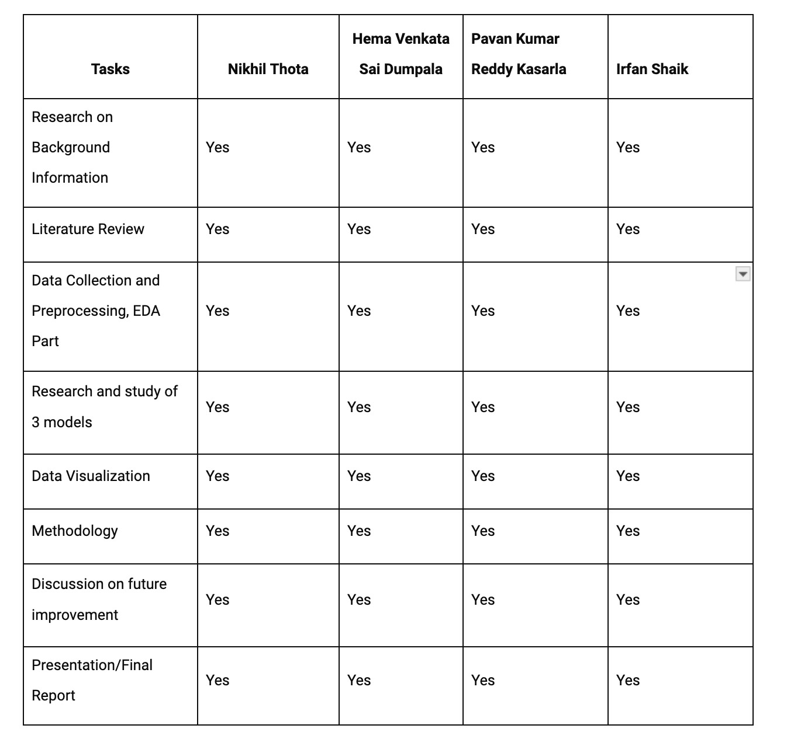

# Instructions to run the project


[1] Download the project file from Download the project files from the data mining directory, by clicking the download present [here] 

[2] A directory was created named **Code** folder in which it contains 7 python files named as **train_val**, **test-scores**, **utils**, **models**, **features**, **beamsearch_utils**, **embeddings**. 

[3] Stored the files in Data by downlaoding it from the link [here](https://drive.google.com/drive/folders/1s7HIloRjuMqaKjntzzXM3nvUs2JYp2rL?usp=drive_link) 

[4] After downlaoding take the Data Folder take ththe sub folder an as the path is important. whihc is in this format 
Structure of the code
Code
Data(the downoaded file from drive should be used in this way)
Features
Generated_files
outputfiles

[5] Download the GloVec params from this link [here]https://nlp.stanford.edu/data/glove.6B.zip for word embedding

[6] I Have also attached differnt files so that it can run faster
## Method: Run in Local Machine

[1] Download the project files from the data mining directory, by clicking the download present [here.](https://drive.google.com/drive/folders/1Aw1vaAMupU_F-OGiN-wsMdwpvwQAlOuS?usp=sharing)

[2] A directory was created named **Code** folder in which it contains 7 python files named as **train_val**, **test-scores**, **utils**, **models**, **features**, **beamsearch_utils**, **embeddings**. 

[3] Select folder **240_DataMining** folder. After downloading, save the file in desired folder and unzip the file (it will be named as **240_DataMining**).

[4] Inside the **DataMining_Project** folder the **Data**, **readme** file, **code** folder, **requirements** text file, **outputfiles** folder are present.

[5] Open Terminal and run the following commands:
```
cd <FILE_PATH>
cd 240_DataMining
pip install -r requirements.txt
``` 
[6] All the required libraries will be downloaded.

[7] Extract the featuers for VGG16 and InceptionV3 by runinng the below command (optional)
```
python Code/features.py
``` 
[8] After running the above command we will run **train_val.py"" which runs all the models as shown below.

python Code/train_val.py

[9] The commands will take more than 4 hrs to exectue asthe number of epochs are 40 for this actually it should be higher to get the desired results but we decreased it to run in our local machines.

[9] After executing the above command now lets run the next following command
```
python code\Test_scores.py
``` 
[10] These commands might take around 1 hour to finish execution as it needs to generate the captions for images. After execution, output is displayed to the console and the images are showed in outputfiles with caption.
(Note: if we increase the epochs the score and captions are generated in a better way, 
       the pkl files are generated for 2 epochs it should run minimum of 30 epochs to generate a caption)

## Team Members contribution to the project 

Team Members Details:

**GROUP**

1) Nikhil Thota : 016791996

2) Pavan Kumar Reddy : 016761732

3) Hema Venkata Sai Dumpala :016704805

4) Irfan Shaik : 016762070

**Contribution of each member:**

 --> contribution in image-> for better represntation
Tasks	Nikhil Thota	Hema Venkata Sai Dumpala	Pavan Kumar Reddy Kasarla	Irfan Shaik
Research on Background Information	Yes	Yes	Yes	Yes
Literature Review	Yes	Yes	Yes	Yes
Data Collection and Preprocessing, EDA Part	Yes	Yes	Yes	Yes
Research and study of 3 models	Yes	Yes	Yes	Yes
Data Visualization	Yes	Yes	Yes	Yes
Methodology	Yes	Yes	Yes	Yes
Discussion on future improvement	Yes	Yes	Yes	Yes
Presentation/Final Report	Yes	Yes	Yes	Yes